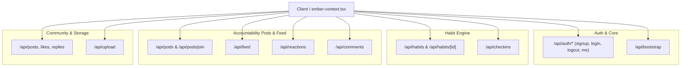

# Disciplr API Documentation

Comprehensive technical reference for all backend API routes implemented across the Disciplr platform (`app/api/`).

---

## 1. System Architecture & Overview

Disciplr's API is structured across 8 core domains using Next.js Route Handlers (`app/api/**/route.ts`). All routes interact with Supabase (PostgreSQL database and Object Storage) with session-based authentication managed through secure HTTP cookies.



---

## 2. Authentication & Session Services (`/api/auth/*`)

Manages user onboarding, credential verification, session tokens, and route protection.

### `POST /api/auth/signup`
* **File**: `app/api/auth/signup/route.ts`
* **Purpose**: Registers a new user account and initiates a session.
* **Authentication**: Not required (public).
* **Request Headers**: `Content-Type: application/json`
* **Request Body**:
  ```json
  {
    "name": "Alex Mercer",
    "email": "alex@example.com",
    "password": "StrongPassword123!"
  }
  ```
* **Behavior**:
  1. Validates presence and format of name, email, and password.
  2. Verifies if email already exists in `users` table.
  3. Hashes password securely.
  4. Inserts new user record with default preferences.
  5. Sets HTTP-only session cookie and returns the user profile.
* **Success Response (`201 Created`)**:
  ```json
  {
    "user": {
      "id": "usr_abc123",
      "name": "Alex Mercer",
      "email": "alex@example.com",
      "avatar": "https://...",
      "streakShields": {
        "totalAvailable": 2,
        "maxPerWeek": 2,
        "usedThisWeek": 0,
        "history": []
      },
      "badges": [],
      "createdAt": "2026-09-04T12:00:00.000Z"
    }
  }
  ```

### `POST /api/auth/login`
* **File**: `app/api/auth/login/route.ts`
* **Purpose**: Authenticates credentials for existing users.
* **Authentication**: Not required.
* **Request Body**:
  ```json
  {
    "email": "alex@example.com",
    "password": "StrongPassword123!"
  }
  ```
* **Behavior**: Matches email, verifies password hash, issues a signed session cookie.
* **Success Response (`200 OK`)**: Returns `{ user: UserProfile }`.

### `POST /api/auth/logout`
* **File**: `app/api/auth/logout/route.ts`
* **Purpose**: Terminates the user's active session.
* **Authentication**: Required.
* **Behavior**: Invalidate/clears the HTTP-only session cookie.
* **Success Response (`200 OK`)**:
  ```json
  { "success": true }
  ```

### `GET /api/auth/me`
* **File**: `app/api/auth/me/route.ts`
* **Purpose**: Resolves the currently authenticated user's profile.
* **Authentication**: Required (reads session cookie).
* **Success Response (`200 OK`)**: Returns current user profile.
* **Error Response (`401 Unauthorized`)**: Returns `{ "error": "Unauthorized" }`.

---

## 3. State Aggregation & Bootstrap (`/api/bootstrap`)

### `GET /api/bootstrap`
* **File**: `app/api/bootstrap/route.ts`
* **Purpose**: Single-roundtrip initialization endpoint to hydrate the entire application state on startup.
* **Role**: Eliminates the "network waterfall" by consolidating what would otherwise be 6 separate HTTP calls into a single database query batch.
* **Authentication**: Required.
* **Data Gathered**:
  1. **User Profile**: Account info, avatar, preferences.
  2. **Habits List**: All active and archived habits with frequency configurations.
  3. **Habit Pod Links**: Mappings from `habit_pods` showing which habits are shared with accountability groups.
  4. **Today's Check-ins**: Cross-checks `habit_logs` for `logged_date = today` to generate `completedTodayHabitIds`.
  5. **Pod Memberships**: All pods the user belongs to along with member rosters.
  6. **Streak Shields**: Shield balance (default 2/week) and forgiveness usage history.
  7. **Milestone Badges**: Unlocked milestone achievements (7-day, 30-day, 100-day streaks).
* **Fault Tolerance**: Non-critical queries (shields, badges, pod links) are isolated in defensive `try/catch` blocks so partial database unavailability will not block the user from accessing their habits.
* **Success Response (`200 OK`)**:
  ```json
  {
    "user": {
      "id": "usr_123",
      "name": "Alex Mercer",
      "username": "alex_mercer",
      "email": "alex@example.com",
      "avatar": "https://...",
      "activePodId": "pod_456",
      "streakShields": {
        "totalAvailable": 2,
        "maxPerWeek": 2,
        "usedThisWeek": 0,
        "history": []
      },
      "badges": []
    },
    "habits": [
      {
        "id": "hab_1",
        "userId": "usr_123",
        "title": "Morning Cold Plunge",
        "emoji": "❄️",
        "frequency": { "type": "daily", "daysOfWeek": [], "timesPerWeek": 7 },
        "reminderTime": "07:00 AM",
        "isPrivate": false,
        "sharedPodIds": ["pod_456"],
        "currentStreak": 14,
        "longestStreak": 14,
        "streakShieldsUsed": 0,
        "isArchived": false,
        "createdAt": "2026-08-20T10:00:00.000Z"
      }
    ],
    "pods": [
      {
        "id": "pod_456",
        "name": "Early Risers",
        "description": "5am crew",
        "emoji": "🌅",
        "inviteCode": "DISCIPLR-EARLY-08",
        "creatorId": "usr_123",
        "maxMembers": 8,
        "members": [...]
      }
    ],
    "completedTodayHabitIds": ["hab_1"]
  }
  ```

---

## 4. Habit Tracking Services (`/api/habits/*`)

### `GET /api/habits`
* **File**: `app/api/habits/route.ts`
* **Purpose**: Retrieves all habits belonging to the authenticated user.
* **Authentication**: Required.
* **Success Response (`200 OK`)**:
  ```json
  {
    "habits": [ ... ]
  }
  ```

### `POST /api/habits`
* **File**: `app/api/habits/route.ts`
* **Purpose**: Creates a new habit record.
* **Authentication**: Required.
* **Request Body**:
  ```json
  {
    "title": "Evening Reading",
    "emoji": "📚",
    "frequency": {
      "type": "daily",
      "daysOfWeek": [1, 2, 3, 4, 5],
      "timesPerWeek": 5
    },
    "reminderTime": "09:00 PM",
    "isPrivate": false,
    "sharedPodIds": ["pod_456"]
  }
  ```
* **Behavior**:
  1. Inserts record into `habits`.
  2. If `sharedPodIds` are provided and `isPrivate` is `false`, creates link records in `habit_pods`.
* **Success Response (`201 Created`)**: Returns `{ "habit": Habit }`.

### `PATCH /api/habits/[id]`
* **File**: `app/api/habits/[id]/route.ts`
* **Purpose**: Modifies an existing habit's title, emoji, frequency, archive state, or linked pods.
* **Authentication**: Required (validates user ownership of habit).
* **Request Body** (Partial updates supported):
  ```json
  {
    "title": "Evening Deep Reading",
    "isArchived": false,
    "sharedPodIds": ["pod_456", "pod_789"]
  }
  ```
* **Success Response (`200 OK`)**: Returns updated `{ "habit": Habit }`.

### `DELETE /api/habits/[id]`
* **File**: `app/api/habits/[id]/route.ts`
* **Purpose**: Permanently deletes a habit.
* **Authentication**: Required (validates user ownership).
* **Behavior**: Removes the habit, cleans up junction records in `habit_pods`, and removes associated logs in `habit_logs`.
* **Success Response (`200 OK`)**: `{ "success": true }`.

---

## 5. Daily Check-In & Milestone Engine (`/api/checkins`)

### `POST /api/checkins`
* **File**: `app/api/checkins/route.ts`
* **Purpose**: Toggles daily habit completion, updates streak counts, records photo proof, and triggers milestone unlocks.
* **Authentication**: Required.
* **Request Body**:
  ```json
  {
    "habitId": "hab_1",
    "proofImageUrl": "https://storage.supabase.co/.../proof.jpg",
    "note": "Completed 30 pages of Deep Work!",
    "timezone": "America/New_York"
  }
  ```
* **State Machine & Logic**:
  * **Toggle-Off (Undo)**:
    If a check-in already exists for `logged_date = today`:
    - Deletes the record from `habit_logs`.
    - Decrements `current_streak` by 1 (clamped to 0).
    - Returns `{ "checkedIn": false, "currentStreak": N }`.
  * **Check-In (Complete)**:
    If not completed today:
    - Inserts a new record into `habit_logs` with proof image and reflection note.
    - Increments `current_streak` by 1.
    - Updates `longest_streak` if `current_streak > longest_streak`.
    - **Milestone Detection**:
      - If streak reaches **7 days**: unlocks `7-Day Spark` badge (`badge_7_spark`).
      - If streak reaches **30 days**: unlocks `30-Day Hearth` badge (`badge_30_ember`).
      - If streak reaches **100 days**: unlocks `100-Day Beacon` badge (`badge_100_beacon`).
* **Success Response (`200 OK`)**:
  ```json
  {
    "checkedIn": true,
    "currentStreak": 7,
    "longestStreak": 7,
    "log": {
      "id": "log_123",
      "habit_id": "hab_1",
      "status": true,
      "proof_image_url": "https://...",
      "note": "Completed 30 pages of Deep Work!",
      "logged_date": "2026-09-04"
    },
    "unlockedBadge": {
      "badge_key": "badge_7_spark",
      "title": "7-Day Spark",
      "icon": "🔥",
      "threshold_days": 7
    }
  }
  ```

---

## 6. Accountability Pods (`/api/pods/*`)

Small circles of up to 8 members designed for mutual accountability and peer encouragement.

### `GET /api/pods`
* **File**: `app/api/pods/route.ts`
* **Purpose**: Retrieves all accountability pods that the current user belongs to.
* **Authentication**: Required.
* **Success Response (`200 OK`)**:
  ```json
  {
    "pods": [
      {
        "id": "pod_123",
        "name": "Focus Sprint",
        "description": "Daily deep work sessions",
        "emoji": "⚡",
        "inviteCode": "DISCIPLR-FOCUS-08",
        "creatorId": "usr_123",
        "maxMembers": 8,
        "members": [
          {
            "userId": "usr_123",
            "name": "Alex Mercer",
            "role": "creator",
            "currentStreak": 5,
            "checkedInToday": true
          }
        ]
      }
    ]
  }
  ```

### `POST /api/pods`
* **File**: `app/api/pods/route.ts`
* **Purpose**: Creates a new accountability pod.
* **Authentication**: Required.
* **Request Body**:
  ```json
  {
    "name": "Morning Grit",
    "description": "5am workouts and cold plunges",
    "emoji": "❄️"
  }
  ```
* **Behavior**:
  1. Creates record in `pods` with a generated unique invite code (`DISCIPLR-XXXX-08`).
  2. Adds the creator to `pod_memberships` with role `'creator'`.
* **Success Response (`201 Created`)**: Returns `{ "pod": Pod }`.

### `POST /api/pods/join`
* **File**: `app/api/pods/join/route.ts`
* **Purpose**: Joins an existing pod using an invite code.
* **Authentication**: Required.
* **Request Body**:
  ```json
  {
    "inviteCode": "DISCIPLR-FOCUS-08"
  }
  ```
* **Validation & Constraints**:
  - Checks if pod exists and invite code matches.
  - Enforces maximum limit of 8 active members.
  - Verifies user is not already a member.
* **Success Response (`200 OK`)**:
  ```json
  {
    "success": true,
    "message": "Successfully joined Focus Sprint!",
    "pod": { ... }
  }
  ```

---

## 7. Social Feed & Engagement (`/api/feed`, `/api/reactions`, `/api/comments`)

### `GET /api/feed`
* **File**: `app/api/feed/route.ts`
* **Purpose**: Retrieves the unified stream of recent check-ins across pods.
* **Authentication**: Required.
* **Query Parameters**:
  - `podId` *(optional)*: Filter check-ins to a specific accountability pod.
* **Response Details**:
  Returns the last 50 check-in logs joined with user avatar, habit metadata, proof image URLs, reaction emojis, and discussion comments.
* **Success Response (`200 OK`)**:
  ```json
  {
    "feed": [
      {
        "id": "log_999",
        "habitId": "hab_1",
        "habitTitle": "Morning Cold Plunge",
        "habitEmoji": "❄️",
        "userId": "usr_456",
        "userName": "Sarah Chen",
        "userAvatar": "https://...",
        "loggedDate": "2026-09-04",
        "status": true,
        "proofImageUrl": "https://...",
        "note": "2 minutes at 45°F!",
        "reactions": [
          { "id": "rxn_1", "emoji": "🔥", "userId": "usr_123" }
        ],
        "comments": [
          { "id": "cmt_1", "userId": "usr_123", "content": "Legendary consistency!" }
        ]
      }
    ]
  }
  ```

### `POST /api/reactions`
* **File**: `app/api/reactions/route.ts`
* **Purpose**: Toggles an emoji reaction (`🔥`, `💪`, `👏`, `🙌`, `🎯`, `❤️`) on a check-in log.
* **Authentication**: Required.
* **Request Body**:
  ```json
  {
    "logId": "log_999",
    "emoji": "🔥"
  }
  ```
* **Behavior**: If the user already added this emoji to this log, it is removed; otherwise, it is inserted.
* **Success Response (`200 OK`)**:
  ```json
  {
    "action": "added" // or "removed"
  }
  ```

### `POST /api/comments`
* **File**: `app/api/comments/route.ts`
* **Purpose**: Adds an encouraging comment to a peer's check-in log.
* **Authentication**: Required.
* **Request Body**:
  ```json
  {
    "logId": "log_999",
    "content": "Keep that streak alive!"
  }
  ```
* **Constraints**: Content is automatically trimmed and capped at **200 characters** to maintain concise, supportive communication.
* **Success Response (`201 Created`)**:
  ```json
  {
    "comment": {
      "id": "cmt_101",
      "content": "Keep that streak alive!",
      "userId": "usr_123",
      "userName": "Alex Mercer",
      "userAvatar": "https://...",
      "createdAt": "Just now"
    }
  }
  ```

---

## 8. Community Posts & Discussions (`/api/posts/*`)

Micro-blogging and discussion forum for broader community sharing or private pod discussions.

### `GET /api/posts`
* **File**: `app/api/posts/route.ts`
* **Purpose**: Fetches discussion posts.
* **Query Parameters**:
  - `scope`: `'community'` (default) or `'pod'`.
  - `podId`: Required if `scope=pod`.
* **Behavior**: Queries recent posts, joins author details and pod badges, counts replies, and checks if the current user has liked each post (`hasLiked: boolean`).
* **Success Response (`200 OK`)**: Returns `{ "posts": Post[] }`.

### `POST /api/posts`
* **File**: `app/api/posts/route.ts`
* **Purpose**: Publishes a new discussion post.
* **Authentication**: Required.
* **Request Body**:
  ```json
  {
    "content": "30 days of consistent meditation changed my focus completely.",
    "mediaUrl": "https://...",
    "podId": "pod_123",
    "isPodOnly": false
  }
  ```
* **Success Response (`201 Created`)**: Returns created `{ "post": Post }`.

### `DELETE /api/posts/[id]`
* **File**: `app/api/posts/[id]/route.ts`
* **Purpose**: Deletes a post created by the user.
* **Authentication**: Required (author check enforced).
* **Success Response (`200 OK`)**: `{ "success": true }`.

### `POST /api/posts/[id]/like`
* **File**: `app/api/posts/[id]/like/route.ts`
* **Purpose**: Toggles like on a post and updates `likes_count`.
* **Authentication**: Required.
* **Success Response (`200 OK`)**: `{ "liked": true, "likesCount": 12 }`.

### `POST /api/posts/[id]/replies`
* **File**: `app/api/posts/[id]/replies/route.ts`
* **Purpose**: Adds a threaded reply to a post.
* **Authentication**: Required.
* **Request Body**:
  ```json
  {
    "content": "What meditation app or technique did you use?"
  }
  ```
* **Success Response (`201 Created`)**: Returns `{ "reply": PostReply }`.

---

## 9. Media & File Upload Service (`/api/upload`)

### `POST /api/upload`
* **File**: `app/api/upload/route.ts`
* **Purpose**: Handles file and image uploads for avatars, check-in photo proofs, and post media.
* **Authentication**: Recommended.
* **Request Format**: `multipart/form-data`
  - `file`: The binary image/file to upload.
  - `bucket` *(optional)*: Target Supabase Storage bucket (`'avatars'`, `'proofs'`, `'profiles'`, `'media'`). Default: `'avatars'`.
* **Robust Fallback Strategy**:
  1. Attempts upload to the designated storage bucket.
  2. If the bucket is not found or fails, attempts cascading fallback buckets (`'profiles'`, `'public'`, `'media'`, `'proofs'`).
  3. If cloud storage is unconfigured or unavailable, encodes the file to a high-quality Base64 Data URL (`data:image/png;base64,...`) and returns it immediately. This guarantees that user interactions never break even in local or test environments.
* **Success Response (`200 OK`)**:
  ```json
  {
    "url": "https://supabase-project.supabase.co/storage/v1/object/public/avatars/profile-images/user_123.jpg"
  }
  ```

---

## 10. Summary Route Table

| Category | Endpoint | Method(s) | Auth | Description |
| :--- | :--- | :---: | :---: | :--- |
| **Auth** | `/api/auth/signup` | `POST` | ❌ | User registration & cookie setup |
| **Auth** | `/api/auth/login` | `POST` | ❌ | Credential login & cookie setup |
| **Auth** | `/api/auth/logout` | `POST` | ✅ | Session invalidation |
| **Auth** | `/api/auth/me` | `GET` | ✅ | Get active user profile |
| **Bootstrap** | `/api/bootstrap` | `GET` | ✅ | Consolidated app startup data (User, Habits, Pods, Logs) |
| **Habits** | `/api/habits` | `GET`, `POST` | ✅ | List habits / Create new habit |
| **Habits** | `/api/habits/[id]` | `PATCH`, `DELETE` | ✅ | Edit habit settings / Archive / Delete |
| **Check-ins** | `/api/checkins` | `POST` | ✅ | Daily check-in toggle, streak math, milestone badges |
| **Pods** | `/api/pods` | `GET`, `POST` | ✅ | List user's pods / Create new pod |
| **Pods** | `/api/pods/join` | `POST` | ✅ | Join accountability pod via invite code |
| **Feed** | `/api/feed` | `GET` | ✅ | Activity stream of check-ins, photo proofs, comments |
| **Feed** | `/api/reactions` | `POST` | ✅ | Add or remove emoji reaction on check-in |
| **Feed** | `/api/comments` | `POST` | ✅ | Post 200-character encouragement comment |
| **Posts** | `/api/posts` | `GET`, `POST` | ✅ | List community or pod discussions / Publish post |
| **Posts** | `/api/posts/[id]` | `DELETE` | ✅ | Remove authored discussion post |
| **Posts** | `/api/posts/[id]/like` | `POST` | ✅ | Toggle like on discussion post |
| **Posts** | `/api/posts/[id]/replies` | `POST` | ✅ | Post comment reply on discussion thread |
| **Upload** | `/api/upload` | `POST` | ✅ | Multipart media upload with bucket & base64 fallbacks |
