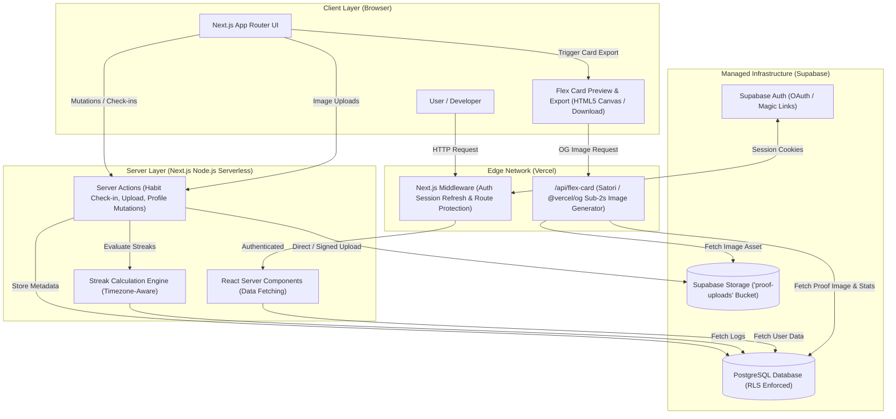
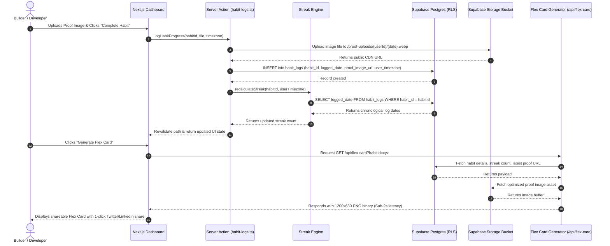

# Production Architecture Plan: Disciplr (PoW Habit Tracker MVP)

This document defines the production-ready architecture boundaries and system flows for **Disciplr**, designed for maximum maintainability by a single developer while adhering to all PRD non-functional requirements.

---

## 1. System Architecture Diagram

---

## 2. System Boundaries & Component Architecture

### A. Frontend Boundary
- **Framework:** Next.js App Router (React 19, TypeScript).
- **Styling & Design System:** Tailwind CSS with dark mode aesthetics (glassmorphic cards, vibrant accent colors, GitHub-style contribution heat-maps).
- **Component Strategy:**
  - **Server Components by Default:** Page layouts, public feeds (`/[username]`), habit lists, and heat-map renders are fetched server-side for fast initial payload and zero client JS overhead.
  - **Client Components (Isolated):** Reserved strictly for interactive inputs (daily check-in toggle, image drop-zone/uploader, Flex Card download handler).

### B. Backend Boundary
- **Mutation Pattern:** Next.js **Server Actions** (`'use server'`) serve as the primary API layer. Eliminates boilerplate REST/GraphQL controllers.
- **Middleware:** Next.js Edge Middleware intercepts incoming requests to refresh Supabase auth cookies and protect dashboard routes (`/dashboard`).
- **Streak Calculation Engine (`utils/streak-engine.ts`):**
  - Pure function layer that accepts UTC log dates, habit creation date, and `user_timezone`.
  - Calculates current streak, longest streak, and 7-day micro-consistency vector while accounting for day boundaries and configured grace periods.

### C. Database Boundary
- **Platform:** Supabase PostgreSQL.
- **Data Model:**
  - `profiles`: User metadata (`id` linked to `auth.users`, `username`, `created_at`).
  - `habits`: Habit definitions (`id`, `user_id`, `title`, `created_at`).
  - `habit_logs`: Daily proof records (`id`, `habit_id`, `status`, `proof_image_url`, `logged_date`, `user_timezone`, `created_at`).
- **Security Guardrails:** Row Level Security (RLS) is enabled on all tables. Users can only perform CRUD operations on rows where `auth.uid()` matches the owner.

### D. Storage Boundary
- **Platform:** Supabase Storage (`proof-uploads` public bucket).
- **Rules & Guardrails:**
  - Storage bucket enforces file size limits (max 5MB per upload) and accepted MIME types (`image/png`, `image/jpeg`, `image/webp`).
  - File paths follow structured namespacing: `{user_id}/{habit_id}/{logged_date}.webp`.
  - Database table `habit_logs` stores only the CDN public URL string (`proof_image_url`). **No base64 or raw blobs in PostgreSQL.**

### E. Image Generation Boundary (Flex Card Engine)
- **Target Performance:** Sub-2-second asset compilation.
- **Architecture:**
  - **Option 1 (Primary - Server Edge):** Route Handler at `/api/flex-card?habit_id=...` powered by `@vercel/og` (Satori). Converts HTML/JSX elements into a 1200x630 PNG with cached fonts and optimized image fetching.
  - **Option 2 (Client Fallback):** HTML5 Canvas / `html-to-image` in the browser for instant 1-click local export without server roundtrips.

### F. Authentication Boundary
- **Platform:** Supabase Auth (Email Magic Link / GitHub OAuth).
- **Session Strategy:** `@supabase/ssr` with HTTP-only, secure, SameSite cookies. Synchronized between Server Components, Server Actions, and Edge Middleware.

### G. Deployment & Operational Boundary
- **Hosting:** Vercel (Next.js edge and serverless deployment).
- **Database & Asset Hosting:** Supabase Cloud (Managed Postgres + S3 Storage CDN).
- **Maintenance Footprint:** Zero custom infrastructure servers to maintain. Single codebase, single deployments pipeline via GitHub integration.

---

## 3. Data & Request Visual Flow

---

## 4. Key Engineering Trade-Offs for Single Developer Maintainability

| Architecture Decision | Chosen Approach | Alternative Considered | Rationale for Single Developer |
| :--- | :--- | :--- | :--- |
| **API Layer** | Next.js Server Actions | REST API / tRPC Controllers | Zero API boilerplate, automatic type safety, direct co-location with components. |
| **Authentication** | Supabase Auth + `@supabase/ssr` | NextAuth / Custom JWT Server | Native RLS integration in Postgres, built-in session cookie syncing. |
| **Database Access** | Supabase JS Client + RLS | Prisma / Drizzle ORM | Eliminates double security layer (ORM logic vs DB rules); RLS guarantees security at DB engine level. |
| **Card Generation** | Satori / `@vercel/og` + Client Canvas | Puppeteer / Headless Chrome | Puppeteer has huge cold starts (>5s) and high memory usage; `@vercel/og` executes on edge in <200ms. |
| **Image Hosting** | Supabase Storage Bucket | AWS S3 / Cloudinary | Keeps all backend services under one Supabase dashboard and authentication model. |
